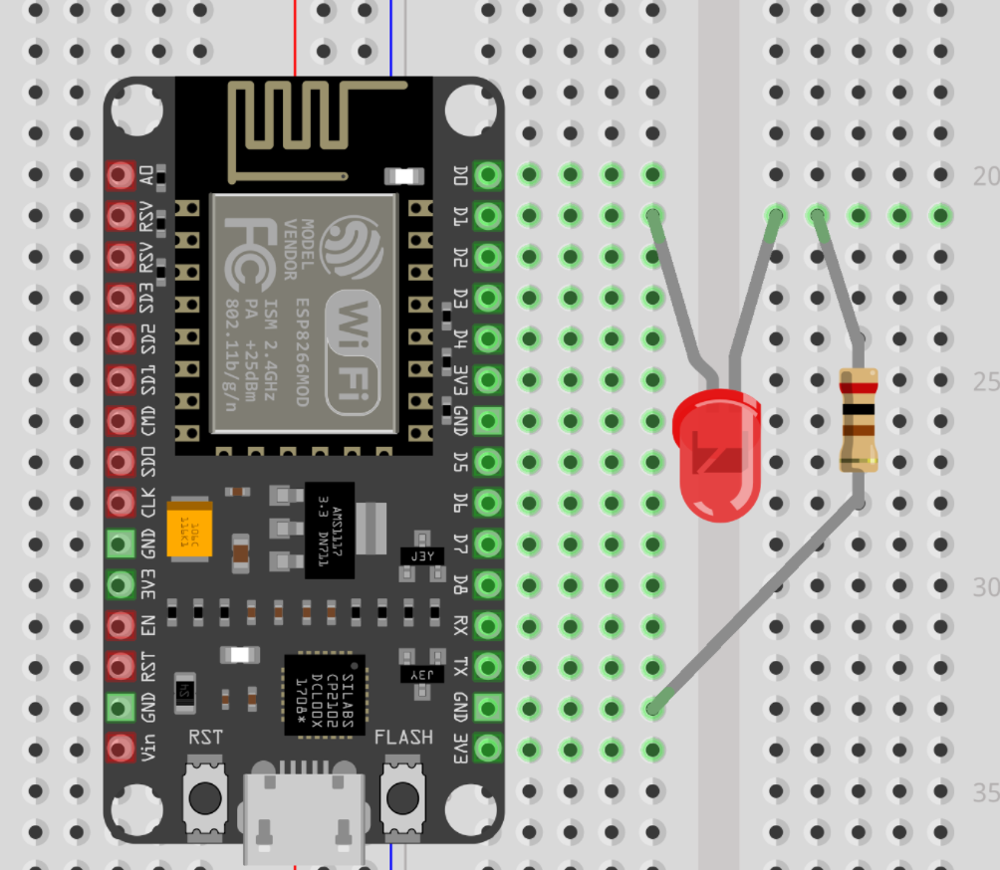
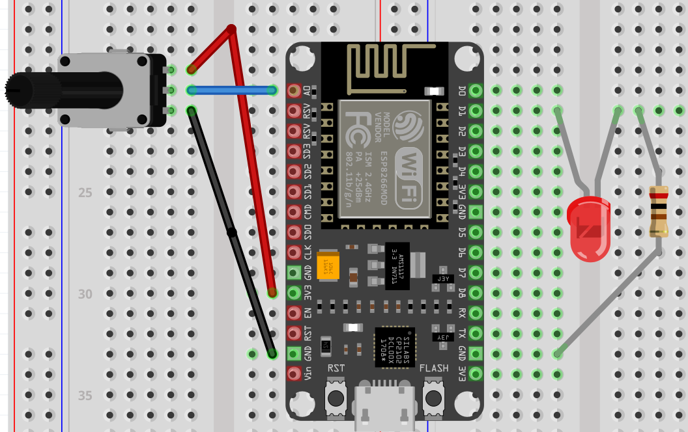

# Kom igång med ESP8266 och Arduino IDE

Den här guiden hjälper dig steg för steg att komma igång med din ESP8266 och Arduino IDE, även om du aldrig har programmerat eller använt Arduino förut.

## Innehållsförteckning
1. [Vad  är ESP8266](#vad-är-esp8266)
2. [Vad är Arduino IDE](#vad-är-arduino-ide)
3. [Vad du behöver](#vad-du-behöver)
4. [Installera Arduino IDE](#installera-arduino-ide)
5. [Installera ESP8266-stöd i Arduino IDE](#installera-esp8266-stöd-i-arduino-ide)
6. [Anslut ESP8266 till din dator](#anslut-esp8266-till-din-dator)
7. [Ladda upp din första kod till ESP8266](#ladda-upp-din-första-kod-till-esp8266)
8. [Övningar](#övningar)
   - [Tänd en LED-lampa](#tänd-en-led-lampa)
   - [Få lampan att blinka](#få-lampan-att-blinka)
   - [Blinka morsekod](#blinka-morsekod)
   - [Blinka snabbt/långsamt](#blinka-snabbt-långsamt)
   - [Fade in Fade Out](#fade-in-fade-out)
9. [Utmaningar](#utmaningar)

## Vad är ESP8266?
ESP8266 är en kraftfull mikrokontroller med inbyggt Wi-Fi. En mikrokontroller är en liten dator som innehåller en processor (CPU), minne och in- och utgångar. Den är designad för att styra andra enheter och utföra specifika uppgifter, som att läsa sensorer eller styra motorer och lampor mm.

## Vad är Arduino IDE?
Arduino IDE (Integrated Development Environment) är ett användarvänligt programmeringsverktyg som används för att skriva, kompilera och ladda upp kod till Arduino-kompatibla mikrokontroller, inklusive ESP8266. Det är särskilt utformat för nybörjare, med ett enkelt gränssnitt och många exempel och bibliotek som gör det enkelt att komma igång med hårdvaruprogrammering. Arduino IDE stöder flera programmeringsspråk, men använder främst en variant av C++.

## Vad du behöver

För att komma igång behöver du följande:
- En dator (Windows, macOS eller Linux)
- En USB-kabel
- Ett ESP8266-utvecklingskort
- Arduino IDE (gratis programvara för att programmera din ESP8266)

## Installera Arduino IDE

1. Gå till [Arduino-webbplatsen](https://www.arduino.cc/en/software) och ladda ner Arduino IDE för ditt operativsystem (Windows, macOS eller Linux).
2. Installera programmet genom att följa instruktionerna på skärmen. För de flesta är det bara att klicka "Nästa" och "Installera" tills installationen är klar.
3. När installationen är klar, öppna Arduino IDE.

## Installera ESP8266-stöd i Arduino IDE

Nu när du har Arduino IDE installerat behöver du lägga till stöd för ESP8266 så att du kan programmera ditt kort.

1. Öppna Arduino IDE om du inte redan gjort det.
2. Gå till `Fil` > `Preferences` 
3. I rutan som heter "Ytterligare URL:er till Board Manager", klistra in följande URL: https://arduino.esp8266.com/stable/package_esp8266com_index.json
Klicka på `OK`.
4. Gå till `Verktyg` > `Kort: "xxx"` > `Kortadministratör`.
5. I sökfältet, skriv `esp8266`. När ESP8266-paketet dyker upp, klicka på `Installera`.
6. Vänta tills installationen är klar, detta kan ta några minuter.

## Anslut ESP8266 till din dator

1. Anslut din ESP8266 till datorn med USB-kabeln.
2. I Arduino IDE, gå till `Verktyg` > `Kort: "xxx"` och välj ditt ESP8266-kort, "NodeMCU 1.0"
3. Gå till `Verktyg` > `Port` och välj den port som ditt ESP8266-kort är anslutet till (vanligtvis COM3, COM4, etc. på Windows eller `/dev/cu.usbserial-xxxx` på macOS).

## Ladda upp din första kod till ESP8266

Nu ska vi ladda upp ett enkelt exempel som blinkar en LED på ditt ESP8266-kort.

1. I Arduino IDE, gå till `Fil` > `Exempel` > `01.Basics` > `Blink`.
2. Koden som öppnas är ett enkelt program som får den inbyggda LED-lampan på ESP8266 att blinka.
3. Klicka på `Pilen` (ladda upp) i övre vänstra hörnet för att kompilera och ladda upp koden till ditt ESP8266-kort.
4. Vänta medan koden kompileras och laddas upp. Du ser en status längst ner i Arduino IDE-fönstret.
5. Om allt fungerar som det ska kommer LED-lampan på ditt ESP8266-kort att börja blinka.

## Övningar

### Tänd en LED-lampa

I den här övningen lär du dig att tända en extern LED-lampa som är kopplad till en GPIO-pin på ditt ESP8266-kort.

**Kopplingsschema:**
- Anslut LED-lampans positiva ben (det *längre*) till D1.
- Anslut LED-lampans negativa ben (det *kortare*) till en 205Ω resistor.
- Anslut resistorns andra ände till GND på ESP8266.



**Kod:**

```cpp
#define LED_PIN 5 // pin D1

void setup() {
  pinMode(LED_PIN, OUTPUT); // Ställer in den valda pinnen som utgång
}

void loop() {
  digitalWrite(LED_PIN, HIGH); // Tänd LED-lampan
}
```

Ladda upp denna kod till ditt ESP8266-kort. LED-lampan kommer att tändas och förbli tänd.

### Få lampan att blinka
I den här övningen ska vi få den externa LED-lampan att blinka med ett enkelt program.

**Kod:**

```cpp
#define LED_PIN 5 // pin D1

void setup() {
  pinMode(LED_PIN, OUTPUT); // Ställer in den valda pinnen som utgång
}

void loop() {
  digitalWrite(LED_PIN, HIGH); // Tänd LED-lampan
  delay(1000);                  // Vänta i 1 sekund
  digitalWrite(LED_PIN, LOW);   // Släck LED-lampan
  delay(1000);                  // Vänta i 1 sekund
}
```

### Blinka snabbt/långsamt
Använd koden från den tidigare övningen, gör de ändringar som krävs för att få lampan att tändas och slackas snabbare/långsammare.

### Blinka morsekod
Nu ska du blinka `sommar och sol` (allas favoritlåt) i morsekod på LED:en. 

Kodningstabell för morsekod visas nedan.


### Fade in Fade Out
I den här övningen ska vi få den externa LED-lampan att Fadea in och out


**Kod:**

```cpp
#define LED_PIN 5 // Pin D1

void setup() {
  pinMode(LED_PIN, OUTPUT); // Sätt den valda pinnen som utgång
}

void loop() {
  // Öka ljusstyrkan från 0 till 255
  for(int i = 0; i <= 255; i++){
    analogWrite(LED_PIN, i); // Öka LED-lampans ljusstyrka
    delay(10); // Lägg till en fördröjning för att se fade-effekten
  }
  
  // Minska ljusstyrkan från 255 till 0
  for(int i = 255; i >= 0; i--){
    analogWrite(LED_PIN, i); // Minska LED-lampans ljusstyrka
    delay(10); // Lägg till en fördröjning för att se fade-effekten
  }
}
```

### Lampbrytare
Här får ni testa att tända och släcka en LED med en knapp. När knappen trycks så växlas LEDen från tänt till släckt eller vice versa.
Koppla enligt nedan:

Ladda sedan upp koden nedan och testa:
```cpp
int buttonPin = D2;  // Knapp ansluten till D2 (GPIO4)
int ledPin = D1;     // LED ansluten till D1 (GPIO5)
int buttonState = 0; // Variabel för att lagra knappens tillstånd
int lastButtonState = 0; // Variabel för att lagra föregående knappens tillstånd
int ledState = LOW;  // Variabel för att lagra LED-lampans tillstånd

void setup() {
  pinMode(buttonPin, INPUT);  // Sätt knapp-pinnen som ingång
  pinMode(ledPin, OUTPUT);    // Sätt LED-pinnen som utgång
  digitalWrite(ledPin, ledState); // Sätt initialt LED-lampans tillstånd till LOW
}

void loop() {
  buttonState = digitalRead(buttonPin);  // Läs knappens tillstånd

  // Kontrollera om knappen har tryckts in (ändring från låg till hög)
  if (buttonState != lastButtonState) {
    if (buttonState == HIGH) {
      // Växla LED-lampans tillstånd
      ledState = !ledState;
      digitalWrite(ledPin, ledState); // Sätt LED-lampans tillstånd
    }
    delay(50); // Debounce-fördröjning för att undvika felaktiga avläsningar
  }
  
  lastButtonState = buttonState; // Spara nuvarande knappens tillstånd
}
```

### Läs av en analog ingång
Härnäst ska vi testa att läsa av värdet på en analog spänning, i detta fall från en potentiometer.
Genom att koppla potentiometern till 3 Volt och jord så kan vi styra spänningen på utgången genom att rotera vredet. 
Vårt är här att läsa av den spänningen. 
**Kopplingsschema:**
- Koppla potentiometerns övre ben till 3 volt (3V) på ESP8266
- Koppla potentiometerns nedre ben till jord (GND) på ESP8266
- Koppla potentiometers mittersta ben till A0 på ESP8266.

**KONTROLLERA ATT ER KOPPLING ÄR KORREKT INNAN NI FORTSÄTTER**


Nu är idén att ni ska återspegla/mappa värdet som läses av från potentiometern till LEDens ljusstyrka.

*Tips: Värdet på potentiometern är mellan 0-1023 men ledstyrkan anges mellan 0-255.*

**Kod:**
```cpp
int potPin = A0;     // Potentiometer ansluten till A0
int ledPin = D1;     // LED ansluten till D1 (GPIO5)
int potValue = 0;    // Variabel för att lagra potentiometer-värdet
int ledBrightness = 0; // Variabel för att lagra LED-ljusstyrkan

void setup() {
  pinMode(ledPin, OUTPUT);  // Sätt LED-pinnen som utgång
}

void loop() {
  potValue = analogRead(potPin);           // Läs potentiometer-värdet (0-1023)
  // FYLL I RESTEN SJÄLVA!
}
```


### Utmaningar:

Här finns lite mer utmanande övningar som endast kräver användandet av tidigare funktioner och lite kreativitet.
För varje utmaning ni lyckas lösa får ni poäng till skattjakten. Lycka till!

- Få lampor att blinka i sekvens.
- Få en slumpvis lampa att blinka varje gång du trycker på en knapp (samma knapp).
- Bygg ett trafikljus. Det blir grönt när du trycker på en knapp.

- Räkna binärt upp till 15 genom att trycka på en knapp.
- Reaktionstidtestare. Bygg en reaktionstidtestare genom att kombinera LEDs och en knapp. Ni ska ge feedback på reaktionstiden genom att låta antingen en röd eller grön lampa lysa beroende på reaktionstiden.
- Morsekod-omvandlare. Ni ska kunna skriva en valfri text och låta programmet omvandla det till Morsekod. Morsekoden ska sedan visas genom en lampa.


